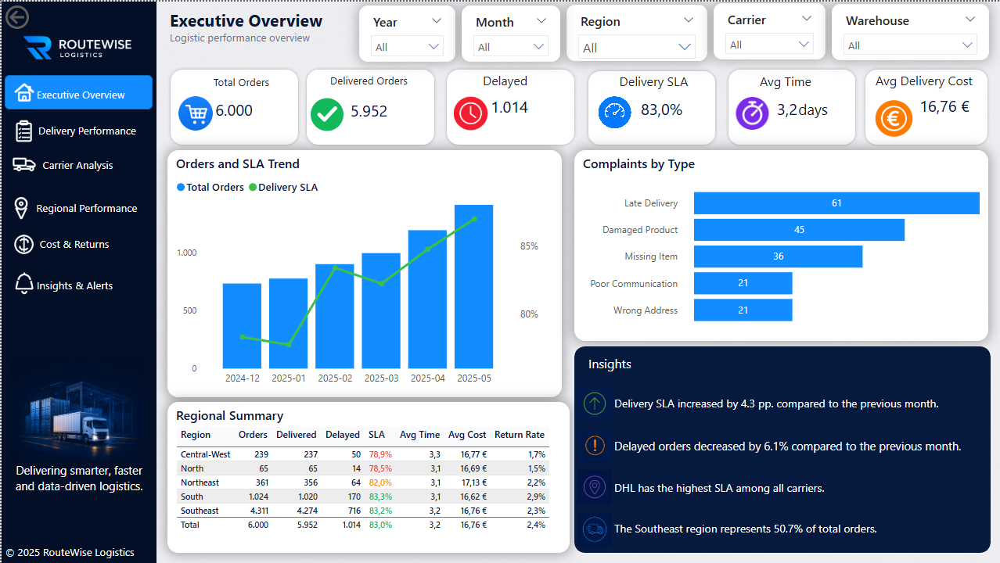
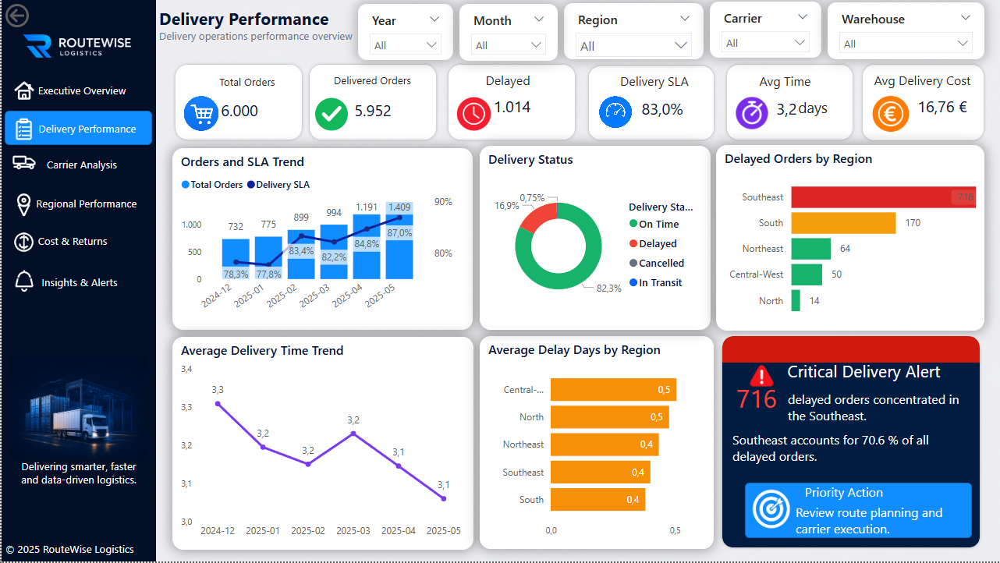
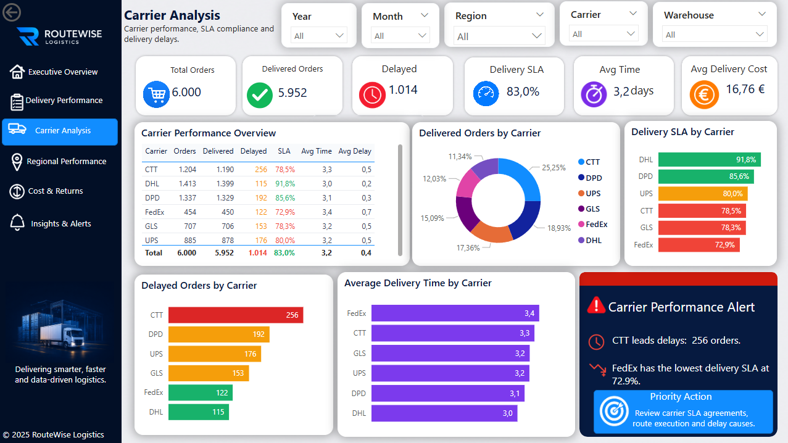
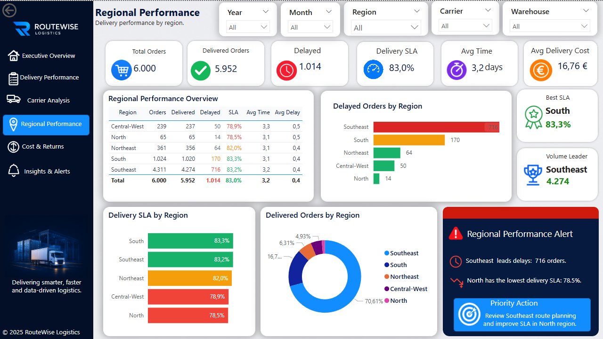
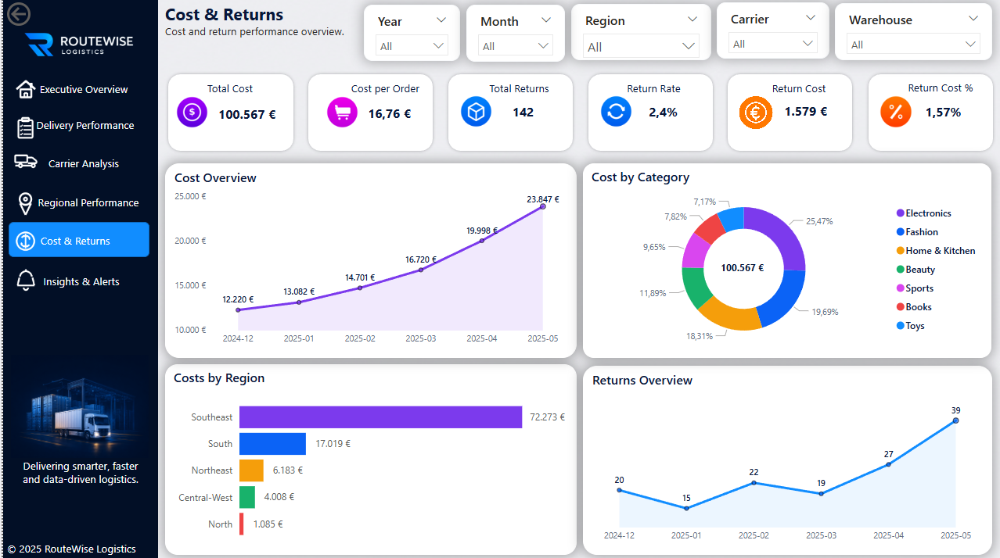
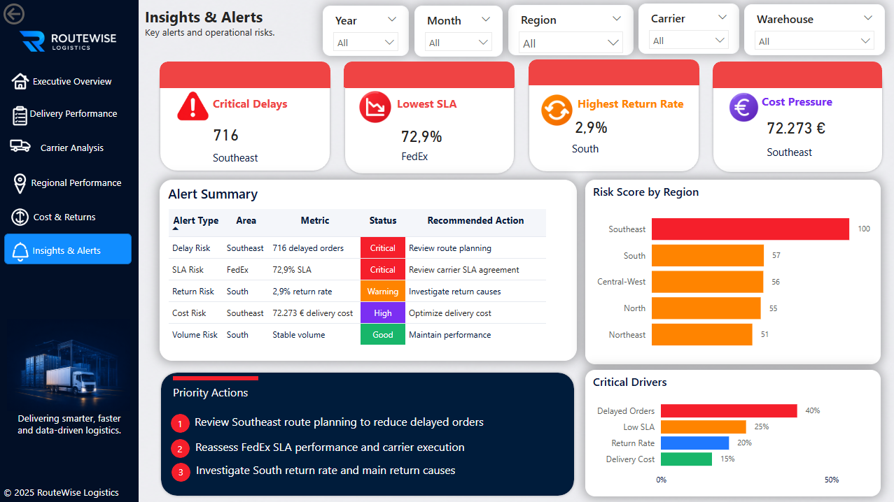
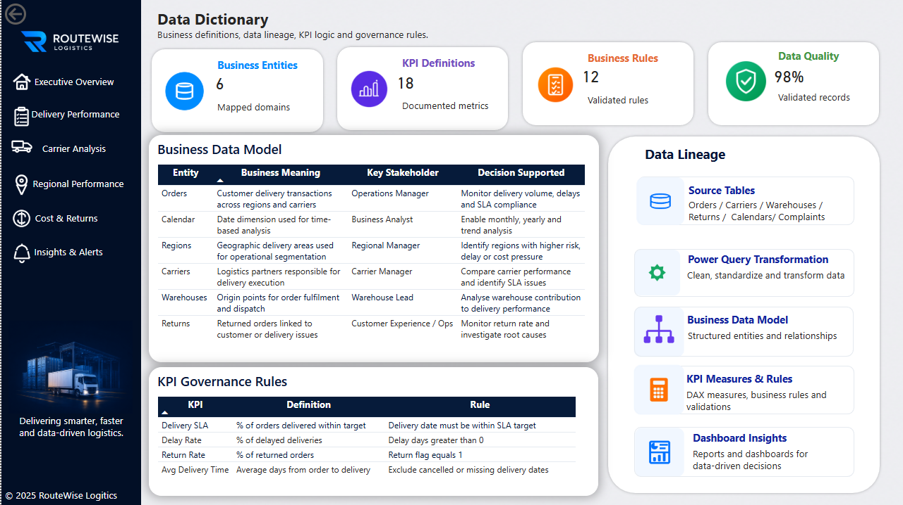

# RouteWise Logistics — Power BI Logistics Performance Dashboard

## Project Overview

RouteWise Logistics is an end-to-end Business Intelligence project developed in Power BI to analyse logistics performance, monitor operational KPIs, identify delays and risks, and support data-driven decision-making.

The project focuses exclusively on data preparation, dimensional modelling, DAX development, interactive data visualisation, KPI monitoring and business insights.

> The data used in this project is fictitious and was created exclusively for educational and portfolio purposes.

---

## Business Objective

Improve visibility into logistics performance by monitoring:

- Deliveries
- SLA compliance
- Delayed orders
- Carrier performance
- Regional performance
- Delivery costs
- Returns
- Customer complaints
- Operational risks

The dashboard helps users identify performance deviations, investigate operational issues and prioritise data-driven actions.

---

## Main KPIs

The dashboard tracks the following indicators:

- Total Orders
- Delivered Orders
- Delayed Orders
- Delivery SLA (%)
- Average Delivery Time
- Average Delivery Cost
- Total Returns
- Return Rate
- Return Cost
- Customer Complaints
- Risk Score by Region

---

## Dashboard Pages

### 1. Executive Overview

Provides a consolidated view of logistics performance, including:

- Main operational KPIs
- Order and SLA trends
- Complaints by type
- Regional summary
- Executive insights
- Recommended actions



### 2. Delivery Performance

Analyses:

- Order volume
- Delivery status
- SLA performance
- Delayed orders by region
- Average delivery time
- Critical delivery alerts



### 3. Carrier Analysis

Compares carrier performance based on:

- Total orders
- Delivered orders
- Delayed orders
- Delivery SLA
- Average delivery time
- Average delay
- Carrier performance alerts



### 4. Regional Performance

Evaluates logistics performance by region, including:

- Order volume
- Delivered orders
- Delayed orders
- Delivery SLA
- Average delivery time
- Regional risks



### 5. Cost & Returns

Analyses:

- Total logistics cost
- Cost per order
- Cost by region
- Cost by category
- Total returns
- Return rate
- Return cost
- Returns trend



### 6. Insights & Alerts

Consolidates the main operational risks and recommended actions:

- Critical delays
- Lowest SLA
- Highest return rate
- Cost pressure
- Risk Score by region
- Critical drivers
- Priority actions



### 7. Data Dictionary

Documents:

- Business entities
- KPI definitions
- Business rules
- Data quality indicators
- Source tables
- Power Query transformations
- Data model
- DAX measures
- Data lineage
- Governance rules



---

## Data Preparation and Transformation

The data preparation process included:

- Importing and validating the dataset
- Cleaning and transforming data in Power Query
- Handling null values and inconsistencies
- Standardising dates, statuses and identifiers
- Creating calculated columns
- Validating records and business rules
- Preparing analysis-ready tables

---

## Data Model

A relational and dimensional data model was created to support efficient analysis.

The model includes:

- Orders
- Carriers
- Regions
- Warehouses
- Returns
- Complaints
- Calendar

Table relationships were defined to enable consistent filtering and accurate KPI calculations.

---

## DAX and KPI Development

DAX measures were created to support:

- Operational volume analysis
- Delivery SLA monitoring
- Delay analysis
- Carrier comparison
- Regional comparison
- Cost analysis
- Return analysis
- Risk identification
- Monthly trend analysis

The KPI logic was documented to improve consistency, traceability and governance.

---

## Data Quality and Governance

The project includes:

- Validation of fields, dates, statuses and identifiers
- Treatment of missing and inconsistent values
- KPI definitions
- Business rules
- Data lineage
- Data quality monitoring
- Documentation of calculation logic

These elements help ensure that the dashboard is based on reliable and understandable information.

---

## Key Insights

The analysis identified the following operational findings:

- The Southeast region concentrates the highest order volume and the highest number of delayed orders.
- The Southeast region records 716 delayed orders.
- The Southeast region represents approximately 70.6% of all delayed orders.
- DHL presents the strongest Delivery SLA.
- FedEx presents the lowest Delivery SLA.
- CTT records the highest number of delayed orders.
- The South region has the highest return rate.
- Delayed orders are the main operational risk driver.
- Route planning and carrier execution are priority improvement areas.

---

## Results and Benefits

The solution provides:

- Clear visibility into logistics performance
- Rapid identification of delays and deviations
- Improved SLA monitoring
- Better control of logistics costs
- Carrier and regional performance analysis
- Proactive risk identification
- Faster operational analysis
- Improved data quality and traceability
- Better support for data-driven decision-making
- Clear communication of business insights

---

## Technologies and Skills

- Power BI
- Power Query
- DAX
- Data Modelling
- Dimensional Modelling
- Data Cleaning
- Data Transformation
- Data Validation
- Data Quality
- Data Governance
- Data Lineage
- KPI Development
- Data Visualisation
- Data Storytelling
- Business Intelligence
- Data Analysis
- Business Analysis
- Root-Cause Analysis
- Performance Monitoring

---

## Repository Structure

```text
routewise-logistics-powerbi-dashboard/
│
├── data/
│   ├── raw/
│   └── processed/
│
├── docs/
│   ├── project-documentation.pdf
│   ├── data-dictionary.pdf
│   └── business-rules.pdf
│
├── images/
│   ├── executive-overview.png
│   ├── delivery-performance.png
│   ├── carrier-analysis.png
│   ├── regional-performance.png
│   ├── cost-and-returns.png
│   ├── insights-and-alerts.png
│   └── data-dictionary.png
│
├── powerbi/
│   └── RouteWise_Logistics_Dashboard.pbix
│
├── README.md
├── LICENSE
└── .gitignore
```

---

## Project Deliverables

- Power BI Dashboard
- Cleaned Dataset
- Relational Data Model
- Documented DAX Measures
- KPI Definitions
- Business Rules
- Data Dictionary
- Data Quality Documentation
- Dashboard Screenshots
- GitHub Documentation

---

## Planned Improvements

- Advanced SQL analysis
- DAX measure optimisation
- Drill-through detail page
- Improved report tooltips
- Expanded business-rules documentation
- Delay forecasting using time-series analysis
- Additional automation for operational alerts

---

## Data Disclaimer

The data used in this project is fictitious and was created exclusively for educational and portfolio purposes.

No real customer, carrier, employee or company information is included.

---

## Author

**Érica Adriana Marques Teodoro**

Electrical Engineer | Business Intelligence | Data Analysis | Business Analysis
